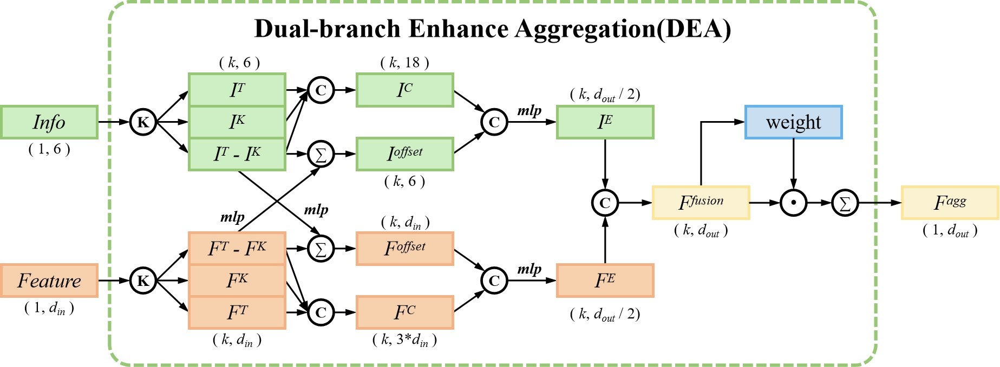
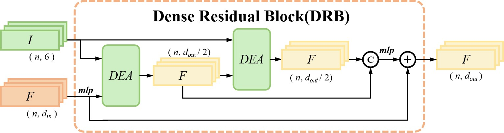
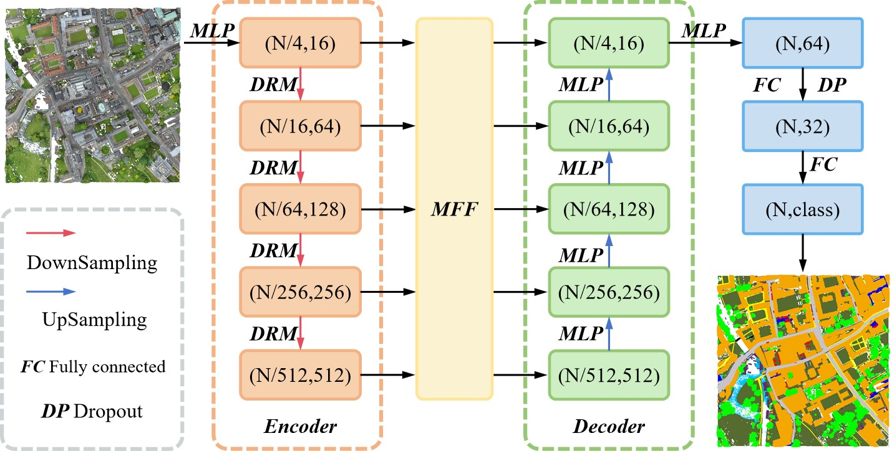
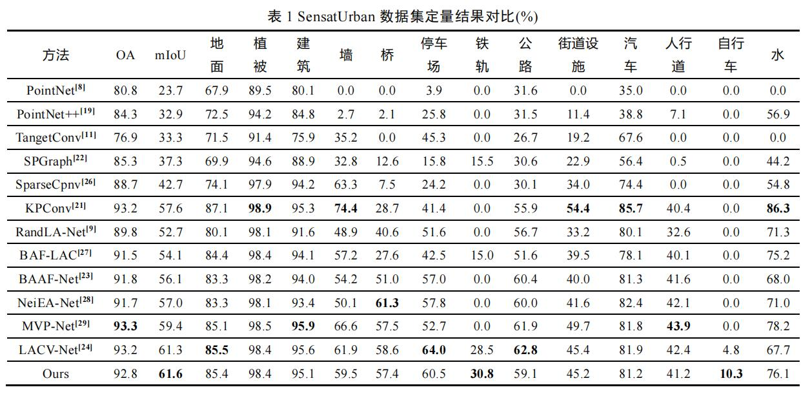
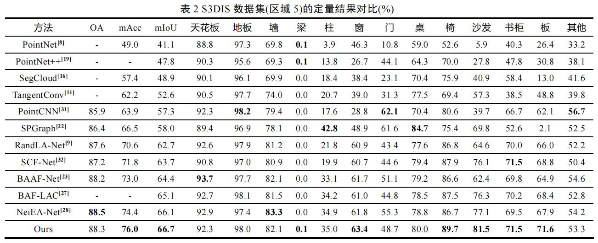

# DEMF-Net：Large scale point cloud semantic segmentation based on Dual branch Enhancement and Multi-scale Fusion

## Method






## Train/Test
SensatUrban
``` shell
python main_SensatUrban --gpu 0 --mode train 
python main_SensatUrban --gpu 0 --mode test 
```
S3DIS
``` shell
python main_S3DIS --gpu 0 --mode train 
python main_S3DIS --gpu 0 --mode test 
```

## Result
SensatUrban

S3DIS

